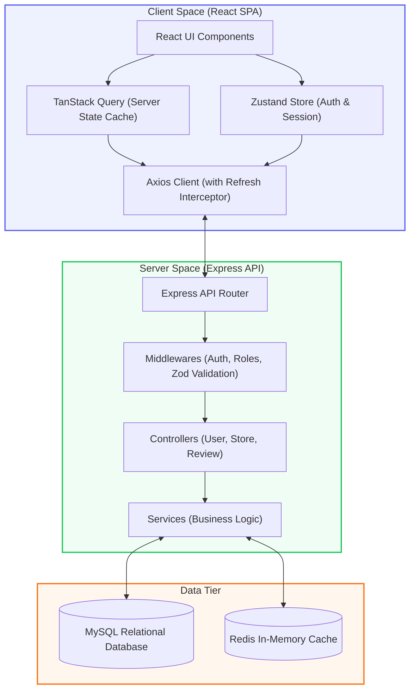
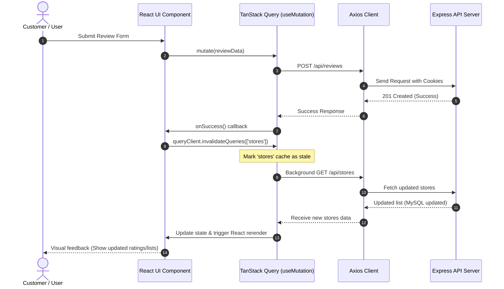
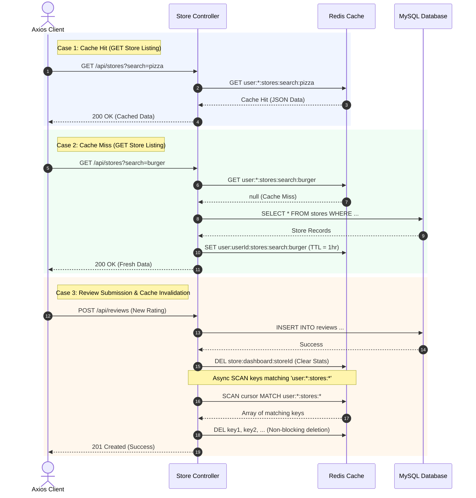

# Roxiler Ratings & Reviews Platform

A high-performance, premium, and stateless Store Ratings & Reviews Platform. The application features a clean split-screen landing page, a responsive customer directory, a store owner performance dashboard, and a system administration portal.

---

## 🛠️ Technical Stack

### Frontend (Client)
- **Core Library**: React (v19.2)
- **Routing**: React Router (v7.17)
- **Global State Management**: Zustand (v5.0) — manages user authentication and active session state.
- **Server-State & Caching**: TanStack Query (React Query v5.101) — manages asynchronous data queries, state caching, and mutations.
- **API Client**: Axios (v1.17) — handles cookie-based sessions, Authorization headers, and silent token refresh interceptors.
- **Styling**: Tailwind CSS (v3.4) & Custom Vanilla CSS variables — supports smooth entry transitions, custom scrollbars, and modern typography (**Plus Jakarta Sans**).
- **Icons**: Lucide React (v1.17)

### Backend (Server)
- **Runtime**: Node.js & Express
- **Primary Database**: MySQL (v8.0) — stores relational data (Users, Ratings, Stores).
- **Caching Layer**: Redis (v7.0-alpine) — caches high-traffic directories and computed rating stats.
- **Auth Systems**: JSON Web Tokens (JWT) — short-lived access tokens (15m) and database-backed rotated refresh tokens (7d) in secure HttpOnly cookies.
- **Validations**: Zod — schema validation for forms and API requests.

### Infrastructure
- **Containers**: Docker & Docker Compose (orchestrates MySQL and Redis database services).

---

## 🔄 Application Workflow

The application supports three distinct user roles, each with custom dashboard views:

### 1. Customer (Normal User)
- **Browse & Search**: Access a real-time list of all registered stores with filtering by store name or address.
- **Submit Ratings**: Submit new ratings (1-5 stars with optional review comments) or modify previous submissions.
- **Profile & Security**: View account credentials and update passwords under strict complexity validation rules.

### 2. Store Owner
- **Performance Dashboard**: Monitor live analytics including overall average rating (with star renders) and total reviews count.
- **Review Ledger**: Browse a complete list of customer reviews featuring Customer Name, Email, Address, rating stars, comments, and submission dates. Support column sorting (Ascending/Descending).
- **Store Profile**: View registered business coordinates and change passwords securely.

### 3. Global Administrator
- **System Metrics**: Read overall metrics (Total Users, Total Stores, Total Ratings).
- **Directory Audit**: Browse, sort, and search all system users and stores. View individual detailed profiles.
- **Account Registration**: Register new users, store owners, or admins (enforces Zod-based inputs). Supplying a password is optional; the server generates secure temporary credentials if left blank.
- **Password Revocation**: Reset passwords for users/stores. Generates new temporary credentials, terminates active login sessions by revoking refresh tokens, and returns credentials in copyable widgets.

---

## 💾 Data Flow & Caching Architecture

### 1. System Architecture



### 2. Client-Side Data Flow



- **Global Authentication**: Handled in a centralized Zustand store (`useAuthStore`). The legacy `AuthContext` wraps this store to act as a backward-compatible bridge for existing consumers.
- **Query Caching**: TanStack Query caches all read operations (store listings, analytics, lists).
- **Mutations & Invalidation**: Modifying actions trigger mutations. Upon success, they invalidate the cache key patterns (e.g. `['stores']`, `['adminUsers']`), prompting background re-fetches to keep the UI reactive.
- **Token Refresh**: Axios interceptors intercept `401 Unauthorized` responses, silently call `/api/auth/refresh` to rotate credentials, and retry the failed requests.

### 3. Backend Data Flow & Redis Caching



- **Read Caching**:
  - **Stores listings**: Cached under keys `user:${userId}:stores:search:${search}` (1-hour TTL).
  - **Owner stats**: Cached under `store:dashboard:${storeId}` (1-hour TTL).
- **Thread-Safe Invalidation**:
  - Rating submissions delete the target owner's dashboard stats (`store:dashboard:${storeId}`).
  - To prevent overall rating calculations from becoming stale, listings cache keys must be cleared. Instead of using the single-threaded blocking `KEYS` command, the server executes an asynchronous, chunked `SCAN` loop (`MATCH user:*:stores:*`) to purge lists without blocking the Redis event loop.
- **Cookie SameSite Policy**: Refresh tokens are stored in HttpOnly cookies with `sameSite: 'lax'` to permit secure cross-port transmission between localhost services.

---

## 🚀 Steps to Start the Project

### Prerequisites
- [Node.js](https://nodejs.org/) (v18 or higher)
- [Docker Desktop](https://www.docker.com/products/docker-desktop/) (running)

### 1. Configure Environment Variables
Create a `.env` file in the `server` directory:
```env
PORT=5000
DB_HOST=127.0.0.1
DB_PORT=3307
DB_USER=roxiler_user 
DB_PASSWORD=roxiler_password (used same value as password)
DB_NAME=roxiler_challenge 

REDIS_HOST=127.0.0.1
REDIS_PORT=6379

JWT_ACCESS_SECRET=your_super_secret_access_key_123! ( I have used the same value as secret key)
JWT_REFRESH_SECRET=your_super_secret_refresh_key_456! ( I have used the same value as secret key)
JWT_ACCESS_EXPIRATION=15m
JWT_REFRESH_EXPIRATION=7d

NODE_ENV=development
```

### 2. Boot Infrastructure (MySQL & Redis)
In the root directory of the project, run:
```powershell
docker compose up -d
```
This spins up:
- **MySQL Container** running on port `3307`. It automatically executes `schema.sql` to initialize tables and seed the default administrator.
- **Redis Container** running on port `6379` with a named persistence volume.

### 3. Start the Backend Server
Navigate to the `server` folder, install dependencies, and start development:
```powershell
cd server
npm install
npm run dev
```
The server will run on `http://localhost:5000`. You will see `Successfully connected to Redis server.` in the terminal.

### 4. Start the Frontend Client
Navigate to the `client` folder, install dependencies, and start development:
```powershell
cd ../client
npm install
npm run dev
```
The client app will boot on `http://localhost:5173`.

---

## 🔑 Default Seed Credentials

For logging into the system:

- **Admin Account**:
  - **Email**: `Admin@gmail.com`
  - **Password**: `Admin@123`
