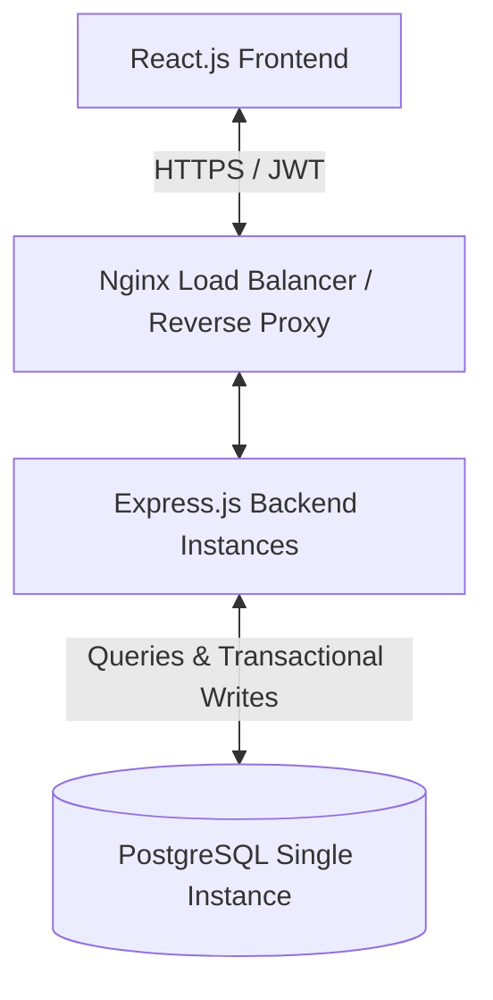

# Implementation Plan - Store Rating Platform (Single Database Edition)

Production-grade architectural blueprint for building a secure, reliable Store Rating Platform using a simplified single-database PostgreSQL architecture. This eliminates the operational overhead of message brokers (RabbitMQ), caches (Redis), and database replicas, running all transactions and queries against a single PostgreSQL instance.

## 1. System Architecture Overview



### Core Technologies
*   **Frontend**: React.js (Vite, TypeScript, TailwindCSS or Vanilla CSS, Axios, React Query)
*   **Backend**: Node.js, Express.js (TypeScript, structured under strict MVC/layered architecture)
*   **Database**: PostgreSQL (Single Instance) with connection pooling (`pg-pool` or `pg`)
*   **Authentication & Session**: JWT (Access Token in-memory + Refresh Token in HttpOnly cookie, tracked in a `refresh_tokens` table for revocation support)
*   **Rate Limiting**: `express-rate-limit` with in-memory storage (or PostgreSQL backend)

---

## 2. Database Schema Design (SQL)

Since we are using a single database without asynchronous replication workers, we update the store ratings transactionally when a rating is created, updated, or deleted.

```sql
-- Enable UUID extension for PostgreSQL
CREATE EXTENSION IF NOT EXISTS "uuid-ossp";

-- 1. Users Table
CREATE TABLE users (
    id UUID PRIMARY KEY DEFAULT uuid_generate_v4(),
    name VARCHAR(60) NOT NULL CHECK (LENGTH(name) >= 20),
    email VARCHAR(255) UNIQUE NOT NULL,
    password VARCHAR(255) NOT NULL,
    address VARCHAR(400) NOT NULL,
    role VARCHAR(20) NOT NULL CHECK (role IN ('admin', 'user', 'owner')),
    created_at TIMESTAMP WITH TIME ZONE DEFAULT CURRENT_TIMESTAMP,
    updated_at TIMESTAMP WITH TIME ZONE DEFAULT CURRENT_TIMESTAMP
);

-- 2. Stores Table
CREATE TABLE stores (
    id UUID PRIMARY KEY DEFAULT uuid_generate_v4(),
    name VARCHAR(100) NOT NULL,
    email VARCHAR(255) UNIQUE NOT NULL,
    address VARCHAR(400) NOT NULL,
    owner_id UUID UNIQUE REFERENCES users(id) ON DELETE SET NULL, -- One Store per Store Owner
    average_rating NUMERIC(3,2) DEFAULT 0.00, -- Updated transactionally or calculated on-the-fly
    total_ratings INTEGER DEFAULT 0,            -- Updated transactionally or calculated on-the-fly
    created_at TIMESTAMP WITH TIME ZONE DEFAULT CURRENT_TIMESTAMP,
    updated_at TIMESTAMP WITH TIME ZONE DEFAULT CURRENT_TIMESTAMP
);

-- 3. Ratings Table
CREATE TABLE ratings (
    id UUID PRIMARY KEY DEFAULT uuid_generate_v4(),
    user_id UUID NOT NULL REFERENCES users(id) ON DELETE CASCADE,
    store_id UUID NOT NULL REFERENCES stores(id) ON DELETE CASCADE,
    rating INTEGER NOT NULL CHECK (rating >= 1 AND rating <= 5),
    created_at TIMESTAMP WITH TIME ZONE DEFAULT CURRENT_TIMESTAMP,
    updated_at TIMESTAMP WITH TIME ZONE DEFAULT CURRENT_TIMESTAMP,
    CONSTRAINT unique_user_store_rating UNIQUE (user_id, store_id)
);

-- 4. Refresh Tokens Table (For secure, single-DB JWT revocation)
CREATE TABLE refresh_tokens (
    id UUID PRIMARY KEY DEFAULT uuid_generate_v4(),
    user_id UUID NOT NULL REFERENCES users(id) ON DELETE CASCADE,
    token VARCHAR(500) NOT NULL UNIQUE,
    expires_at TIMESTAMP WITH TIME ZONE NOT NULL,
    created_at TIMESTAMP WITH TIME ZONE DEFAULT CURRENT_TIMESTAMP
);

-- Indexes for performance
CREATE INDEX idx_users_role ON users(role);
CREATE INDEX idx_stores_name_address ON stores(name, address);
CREATE INDEX idx_ratings_store_id ON ratings(store_id);
CREATE INDEX idx_refresh_tokens_token ON refresh_tokens(token);
```

---

## 3. Core Website Data Flow

### A. Authentication & Registration Flow
1.  **Register (Normal User)**:
    *   Client inputs Name (20-60 chars), Email, Address (max 400 chars), Password (8-16 chars, 1 uppercase, 1 special char).
    *   Express backend validates inputs using `zod` schema middleware.
    *   Password is hashed using `bcrypt` and saved.
2.  **Login with Rate Limiting**:
    *   Client sends credentials.
    *   Express authentication middleware executes a **Sliding Window Rate Limiting** check (using memory-store or a simple DB table check).
    *   If rate limits are exceeded, return `429 Too Many Requests`.
    *   Otherwise, authenticate credentials, generate Access Token, insert Refresh Token into the `refresh_tokens` table, and return it in a secure HttpOnly cookie.

### B. Transactional Rating Submission & Calculations
Without RabbitMQ or Outbox workers, rating submissions are processed directly:
1.  **Transactional Write**:
    *   User submits a rating.
    *   Backend opens an SQL transaction:
        *   Inserts or updates the rating record in the `ratings` table.
        *   Recalculates `average_rating` and `total_ratings` for the store:
            ```sql
            SELECT AVG(rating) as avg_r, COUNT(rating) as count_r FROM ratings WHERE store_id = $1
            ```
        *   Updates the `stores` record with the new average and count.
        *   Commits transaction.
    *   This guarantees atomic, strong consistency immediately. There is no lag between a rating submission and it reflecting on the UI.

---

## 4. Single-Database System Design Decisions

### Direct Transactional Updates (Immediate Consistency)
*   **Pros**: Highly consistent (reads immediately reflect rating updates), simpler backend codebase, fewer dependencies, no message broker configurations or consumer threads.
*   **Cons**: Higher database write lock time per rating, but perfectly suitable for typical database loads.

### In-Memory vs DB-Based Rate Limiting
*   Instead of Redis Sorted Sets, we will use the standard Express `express-rate-limit` middleware. We can back it with:
    *   **In-Memory Store**: Extremely fast, but resets if the backend process restarts.
    *   **PostgreSQL-Based Store**: Persistent rate limiting that works across multiple server instances (if load balanced).

---

## 5. Security & Form Validations

### Inputs validation (Strict Zod validation)
*   **Name**: 20 to 60 characters.
*   **Address**: Max 400 characters.
*   **Password**: 8-16 characters, must include at least one uppercase letter and one special character.
*   **Email**: Follow standard email regex format.

### Security Best Practices
*   **CORS & Helmet**: Protect endpoints and browser parameters.
*   **Parameterized SQL**: Prevent SQL injection.
*   **XSS Protection**: Sanitize input fields to block malicious scripts.
*   **HttpOnly Cookies**: Secure storage of Refresh Tokens.

---

## 6. Proposed Changes

We will build the Node/Express backend from scratch inside the `server/` directory and update the React frontend inside `client/`.

### Database & Backend
#### [NEW] [db.ts](file:///D:/WEB%20DEV/Roxiler_challenge/server/src/config/db.ts)
- Setup PostgreSQL client connection pool using `pg`.
#### [NEW] [schema.sql](file:///D:/WEB%20DEV/Roxiler_challenge/server/src/db/schema.sql)
- SQL definitions for `users`, `stores`, `ratings`, `refresh_tokens`.
#### [NEW] [auth.middleware.ts](file:///D:/WEB%20DEV/Roxiler_challenge/server/src/middlewares/auth.middleware.ts)
- JWT verification and role-based permissions checking.
#### [NEW] [rateLimit.middleware.ts](file:///D:/WEB%20DEV/Roxiler_challenge/server/src/middlewares/rateLimit.middleware.ts)
- `express-rate-limit` configuration.
#### [NEW] [user.controller.ts](file:///D:/WEB%20DEV/Roxiler_challenge/server/src/controllers/user.controller.ts)
- User sign up, log in, token refresh, and logout handlers.
#### [NEW] [store.controller.ts](file:///D:/WEB%20DEV/Roxiler_challenge/server/src/controllers/store.controller.ts)
- Store management (CRUD) for admins and owners.
#### [NEW] [rating.controller.ts](file:///D:/WEB%20DEV/Roxiler_challenge/server/src/controllers/rating.controller.ts)
- Rating submission/update handlers with immediate transactional calculations.

### Frontend
#### [MODIFY] [package.json](file:///D:/WEB%20DEV/Roxiler_challenge/client/package.json)
- Add dependencies like Axios, React Router, and TailwindCSS (or Vanilla CSS custom setup) if needed.
#### [MODIFY] [App.jsx](file:///D:/WEB%20DEV/Roxiler_challenge/client/src/App.jsx)
- Set up main layout, styling structure, routing, and user interface.
#### [NEW] [storeList.jsx](file:///D:/WEB%20DEV/Roxiler_challenge/client/src/components/storeList.jsx)
- Interactive store directory with filter and sort options.
#### [NEW] [authPages.jsx](file:///D:/WEB%20DEV/Roxiler_challenge/client/src/components/authPages.jsx)
- Clean, responsive registration and login forms with strict validation warnings.

---

## 7. Open Questions & User Review Required

> [!IMPORTANT]
> **Rate Limiting Store Choice**
> Since we removed Redis, should we use in-memory rate limiting (simple, fast, but resets if server restarts) or implement a database-backed rate limiter (using a PostgreSQL table via `rate-limit-postgresql` or custom SQL table) to guarantee persistence?

> [!TIP]
> **Averages Recalculation Implementation**
> We plan to compute store average ratings directly inside the rating write transaction using a subquery and update the `stores` table denormalized columns (`average_rating`, `total_ratings`). Alternatively, we could compute these statistics dynamically on read queries using SQL aggregations. However, updating them on write keeps read queries extremely fast. Let us know if you have a preference.

## 8. Verification Plan

### Automated Tests
*   Verify API endpoints with standard integration test suite or manual API calls using `curl` / Postman configurations.
*   Validate DB transaction locks and concurrency.

### Manual Verification
*   Test input validation limits (Name, Address, Password validation rules).
*   Demonstrate correct calculation of averages when adding/updating/deleting ratings.
*   Ensure HTTP HttpOnly cookie setting and refresh token cycles operate correctly.
